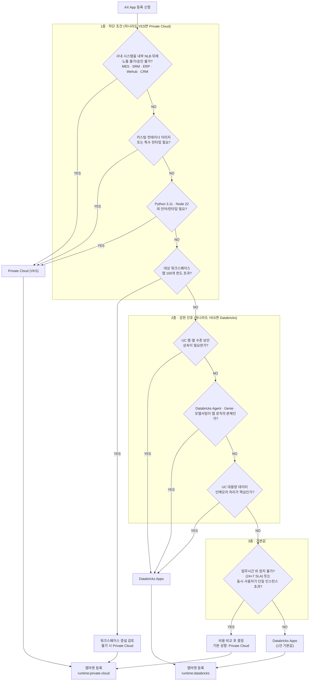
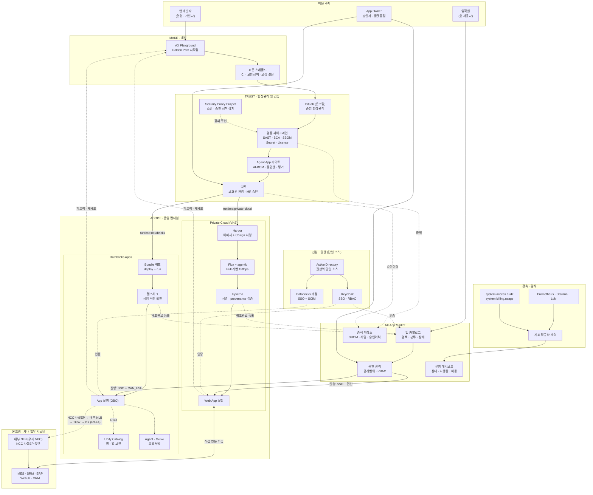

# ③ 런타임 판정 기준 및 To-Be 전체 구성

> **목적**: AX App의 런타임 배치 기준을 판정 가능한 형태로 확정하고, AX App Market의 To-Be 전체 구성을 정의한다. 원 기획서(`AX앱마켓구성1.pdf`)의 "전체 구성을 그려보자"에 대한 산출물.
> **작성일**: 2026-09-10
> **선행 문서**: `databricks-apps-reference.md`, `cicd-devsecops-research.md`, `01`, `02`

### 확정된 전제 (2026-09-12)

| # | 사실 | 영향 |
|---|---|---|
| **F1** | **클라우드 = AWS, 리전 = ap-northeast-2 (서울)** | A2 해소 — Entra ID 고정 리스크 없음. 개인정보 국외이전 이슈 해소 |
| **F2** | **Databricks는 별도 전용 AWS 계정** | 앱마켓 계정과 분리. cross-account 구성 → `05` 문서 §1 |
| **F3** | **Databricks 계약 = Enterprise tier** | **NCC 사설 엔드포인트와 네트워크 정책 사용 가능** → A1 뒤집힘. Q1 재정의(§3) |
| **F4** | **온프렘 ↔ AWS = VPN + Direct Connect + TGW 기구축, 라우팅 구성 완료** | Databricks Apps → 온프렘 경로가 성립(§3 Q1). Playground → 온프렘 GitLab push 성립 |
| **F5** | **사용자 진입 = Direct Connect 경유 (인터넷 노출 없음)** | 앱마켓은 내부 ALB, Databricks Apps는 front-end PrivateLink → `05` 문서 §2 |
| **F6** | **앱마켓은 AWS 전용 계정에 별도 구현** | 런타임이 아닌 플랫폼 서비스로 분리 → `05` 문서 §5 |
| **F7** | **AX Playground = Coder 기반 클라우드 개발환경** (Coder Server + 워크스페이스 EC2 + VS Code·Claude Code Dev Container + Bedrock) | 구성요소 표의 "재정의 필요" 해소. 스캐폴드 배포 수단이 Coder 템플릿으로 확정 |

### 남은 가정

| # | 가정 | 미확정 시 영향 | 확정처 |
|---|---|---|---|
| A3 | GitLab **Ultimate** tier | §4 검증 게이트 강제 | `02` 문서 §11-2 |
| A4 | WIF 시나리오 A (성립) | §4 배포 인증 | `01` 문서. **F4로 해결되지 않음** — 컨트롤 플레인의 JWKS 조회는 DX를 타지 않는다 |
| A5 | 망분리 대상 여부·취급 데이터 등급 **미정** | Q1 승인 가능성, Bedrock 엔드포인트 구성, 데이터 등급별 런타임 제약 | 보안·정보보호 협의 (`05` 문서 §8) |

---

## 1. 판정 원칙

기획서의 "데이터브릭스 내 데이터가 필요한 경우"라는 기준은 실무에서 갈리지 않는다. 업무앱 대부분이 데이터를 필요로 하고, Databricks 데이터는 SQL Warehouse·JDBC로 Private Cloud에서도 접근 가능하기 때문이다.

따라서 판정을 **세 층으로 분리**한다.

```
1층. 차단 조건   — Databricks Apps로 "갈 수 없는" 이유가 있는가?     → 있으면 Private Cloud 확정
2층. 강한 선호   — Databricks Apps여야 "이득이 큰" 이유가 있는가?   → 있으면 Databricks 확정
3층. 기본값     — 둘 다 아니면 1안에 따라 Databricks Apps
```

**차단 조건을 먼저 보는 것이 핵심이다.** 선호도부터 따지면 물리적으로 불가능한 배치를 검토하느라 시간을 쓴다.

---

## 2. 런타임 판정 트리



---

## 3. 판정 기준 상세

각 분기의 근거다. **판정자가 "왜 이렇게 갈리는가"를 설명할 수 있어야** 기준이 유지된다.

### 1층 — 차단 조건

| # | 질문 | 근거 | 출처 |
|---|---|---|---|
| **Q1** | **사내 시스템을 내부 NLB 뒤에 노출할 수 없는가?** (또는 보안 승인 불가) | Enterprise tier에서 **Apps egress → NCC 사설 엔드포인트 → 우리 VPC 내부 NLB** 경로가 공식 지원되고, NLB 이후 구간은 기구축 TGW·DX가 처리한다. 즉 물리적 불가가 아니라 **노출 승인 여부**의 문제 | ✅ F3·F4 / `05` 문서 §3 |
| **Q2** | 커스텀 이미지·특수 런타임? | Databricks Apps의 배포 단위는 **소스 + 설정**이며, 커스텀 Docker 이미지를 레지스트리에서 가져와 실행하는 경로가 문서에 없음 | `databricks-apps-reference.md` §2 |
| **Q3** | 지원 외 언어/런타임? | Ubuntu 22.04 / Python 3.11 / Node.js 22.16 고정 | 동 §2 |
| **Q4** | 앱 100개 한도? | **워크스페이스당 100개, 조정 불가(fixed)** | 동 §3 |

> **⚠️ Q1은 2026-09-12에 재정의되었다.** 종전에는 "사내 시스템 직접 연동 필요? → YES면 Private Cloud 확정"이었고, 근거는 "서버리스에서 온프렘으로의 직접 연동이 물리적으로 불가"(가정 A1)였다. **F3(Enterprise tier)·F4(DX 기구축)로 A1이 뒤집혔다.**
>
> 성립하는 경로는 다음과 같다. → 상세는 `05` 문서 §3
>
> ```
> Databricks App (서버리스)
>    → NCC 사설 엔드포인트 (PrivateLink)
>    → 우리 VPC의 내부 NLB
>    → NLB 타깃 → TGW → Direct Connect
>    → 온프렘 MES / SRM / ERP / Wehub / CRM
> ```
>
> **판정 트리의 무게중심이 1층에서 2층으로 이동한다.** 그리고 이것이 "1안 = Databricks Apps 우선" 방침의 명분을 **약화시키지 않고 오히려 강화한다** — 물리적으로 막혀서 갈라지는 것이 아니라, **Q5의 통제 이점 때문에 선택하는 것**이 되기 때문이다. 기획서에 "배경과 명분을 강화해야 한다"고 적어 둔 부분에 대한 답은 이제 Q1이 아니라 **Q5(UC 행·열 보안 상속)** 가 지탱한다.
>
> **남은 조건 2가지** (`05` 문서 §3)
> - 사내 시스템을 내부 NLB 뒤에 노출하는 것에 대한 **보안팀 승인** — 이것이 Q1의 실질 판정 기준이 된다
> - **NLB 타깃을 온프렘 IP로 두는 구성의 검증** — Databricks 문서 범위 밖이며 네트워크 담당 확인 필요

### 2층 — 강한 선호

| # | 질문 | 근거 |
|---|---|---|
| **Q5** | UC 행·열 보안 상속? | OBO 사용 시 **UC의 행 필터·컬럼 마스킹이 자동 적용**된다. Private Cloud에서 동등 통제를 구현하려면 앱 코드가 책임져야 하며, 이는 검증으로 잡아내기 가장 어려운 유형의 위험이다 |
| **Q6** | Agent·Genie·모델서빙이 본체? | Apps + Agents 조합이 표준. Genie space는 MCP URL로 접근, 최대 25개 UC 테이블 |
| **Q7** | 대용량 인메모리 처리? | 데이터 근접성. 단 Large도 4 vCPU / 12 GB 상한 |

> **Q5의 판정 가치가 가장 높다.** 데이터 거버넌스 책임을 앱 코드에서 플랫폼으로 옮길 수 있다는 것은 단순 편의가 아니라 **보안 통제 등급의 차이**다.

### 3층 — 기본값과 비용

| # | 질문 | 근거 |
|---|---|---|
| **Q8** | **업무시간 외 정지가 불가능한가(24×7 SLA)?** | Medium 0.5 DBU/h, Large 1 DBU/h로 **실행 중 상시 과금**이며 **Apps에는 auto-stop 기능이 없다.** 정지 불가 앱이 비용 게이트 대상 |
| **Q8′** | 동시 사용자 규모가 단일 인스턴스 한도를 넘는가? | Large도 최대 4 vCPU / 12 GB이고 **수평 확장은 Beta.** 이건 비용이 아니라 용량 천장이므로 사실상 1층 차단 조건에 가깝다 |

> ⚠️ **Q8은 원래 "상시 고트래픽?"이었으나 재정의했다.** 비용은 트래픽이 아니라 **앱 개수 × 구동 시간**에서 발생한다. 저트래픽 앱 100개가 고트래픽 앱 1개보다 훨씬 비싸다. → `04-cost-model.md` §5-d

**비용 비교는 공통 환산 기준이 정의된 후에야 가능하다.** 그전까지는 Q8을 "판단 보류 후 플랫폼팀 협의"로 처리한다.

> 💰 **3층 기본값은 조건부다.** "둘 다 NO → Databricks Apps"의 실제 비교 대상은 DBU 단가 vs 클라우드 VM 단가가 아니라 **연 수억원 vs 거의 0**이다(VKS는 기구축 온프렘 하드웨어이므로 파드 하나의 한계비용이 0에 가깝다). 따라서 **유휴 정지 정책과 공용 웨어하우스 규칙이 플랫폼에 구현되어 있는 동안에만 Databricks Apps를 기본값으로 한다.** 1단계(앱 10개 내외)에서는 1안이 타당하나, 미구현 상태에서 앱 수가 늘면 비용이 선형으로 따라 올라간다. → `04-cost-model.md` §5-a, §6

### 판정 체크리스트 (등록 신청서 양식용)

```
[1층 차단 조건]
[ ] Q1. 사내 시스템(MES/SRM/ERP/Wehub/CRM) 연동이 필요하고,
       그 시스템을 내부 NLB 뒤에 노출하는 것이 불가하거나 보안 승인을 받을 수 없습니까?
[ ] Q2. 커스텀 컨테이너 이미지나 특수 런타임이 필요합니까?
[ ] Q3. Python 3.11 / Node.js 22 외의 언어·런타임이 필요합니까?
[ ] Q4. (플랫폼팀 확인) 대상 워크스페이스 앱 수가 한도에 근접했습니까?

[2층 선호 조건]
[ ] Q5. Unity Catalog의 행·열 수준 보안을 그대로 적용받아야 합니까?
[ ] Q6. Databricks Agent/Genie/모델서빙이 앱 기능의 핵심입니까?
[ ] Q7. UC 대용량 데이터의 인메모리 처리가 핵심입니까?

[3층]
[ ] Q8.  업무시간 외 정지가 불가능합니까? (24×7 SLA 요구)
[ ] Q8′. 예상 동시 사용자가 단일 인스턴스(최대 4 vCPU) 한도를 넘습니까?

→ 1층 하나라도 YES: Private Cloud
→ 1층 전부 NO + 2층 하나라도 YES: Databricks Apps
→ 둘 다 NO + Q8·Q8′ 전부 NO: Databricks Apps (기본값, 단 §3 3층의 조건부 단서 적용)
→ 둘 다 NO + Q8 YES: 플랫폼팀 비용 협의
→ Q8′ YES: 용량 천장이므로 Private Cloud (수평 확장 GA 전까지)
```

---

## 4. To-Be 전체 구성



### 구성요소별 역할

| 영역 | 구성요소 | 역할 | 상태 |
|---|---|---|---|
| MAKE | **AX Playground** | **Coder 기반 클라우드 개발환경** (Coder Server + 워크스페이스 EC2 + VS Code·Claude Code Dev Container + Bedrock). Golden Path 시작점이며, 스캐폴드는 **Coder 워크스페이스 템플릿 + Dev Container 이미지**로 배포된다 | PoC 가동 중 (F7) |
| TRUST | **GitLab (온프렘)** | 중앙 형상관리 + CI/CD + 보안 스캔 + 정책 강제 | 기구축 |
| TRUST | **Security Policy Project** | 스캔·승인 정책을 코드로 관리. `[skip ci]` 우회 차단 | 신규 |
| ADOPT | **Private Cloud (VKS)** | 사내 시스템 연동 앱, 커스텀 런타임 앱 | 기구축 |
| ADOPT | **Databricks Apps** | UC 데이터 앱, Agent App. **1안 우선 적용 대상** | 신규 |
| MARKET | **AX App Market** | 카탈로그 · 권한 · 증적 · 운영 지표 | 신규 |
| 신원 | **AD → Keycloak / Databricks** | 권한의 단일 소스 | 일부 기구축 |

---

## 5. 인증 · 권한 매핑

기획서에서 "SSO 그룹 연동" 한 줄로만 있던 부분을 구체화한다.

### 5-1. 신원 체계

**AD를 권한의 단일 소스로 두고, 양쪽이 이를 상속하는 구조**가 가장 단순하다.

```
Active Directory (단일 소스)
├─ Keycloak (OIDC/SAML)  ──▶ App Market 로그인
│                        ──▶ Private Cloud 앱 SSO + RBAC
└─ Databricks 계정 SSO   ──▶ Databricks 워크스페이스 로그인
   (SAML 2.0 / OIDC,        ──▶ Databricks 그룹 (SCIM 동기화)
    unified login)
```

✅ **F1로 해소되었다.** AWS Databricks이므로 Entra ID 고정 제약이 없고, 계정 레벨 SSO가 SAML 2.0 / OIDC를 지원하므로 **Keycloak을 OIDC IdP로 직접 연동하는 경로가 열려 있다.** 다만 레퍼런스 사례 확인은 남아 있다(`databricks-apps-reference.md` §11-7).

### 5-2. 앱 실행 권한의 투영

앱마켓의 "권한에 따라 실행"이 각 런타임에 어떻게 투영되는지다.

| 단계 | Private Cloud | Databricks Apps |
|---|---|---|
| 앱마켓에서 공개범위 지정 | AD 그룹 / 조직 단위 지정 | 동일 |
| 런타임 권한 부여 | Keycloak RBAC + Ingress 인가 정책 | **Databricks 그룹에 `CAN_USE` 부여** |
| 사용자 인증 | Keycloak SSO | Databricks 계정 SSO |
| 데이터 접근 통제 | **앱 코드 책임** | **OBO → UC 행·열 보안 자동 적용** |
| 권한 회수 반영 | Keycloak 즉시 | 그룹 동기화 주기에 의존 |

**설계 결정 3가지**

1. **`CAN_USE`가 Databricks 트랙의 실질적 실행 권한 수단이다.** 앱마켓 RBAC → AD 그룹 → Databricks 그룹 → `CAN_USE` 경로를 API로 자동화한다.
2. **권한 회수 반영 지연을 명시한다.** SCIM 동기화 주기만큼 시차가 발생한다. 즉시 차단이 필요한 경우(퇴사·사고)의 별도 절차를 정의해야 한다.
3. **앱 권한이 `CAN_USE`/`CAN_MANAGE` 2단계뿐이므로**, 앱 내부의 세분 역할(조회자/승인자/관리자)은 앱마켓이 전달하는 권한 정보 또는 UC 권한으로 처리한다. Databricks 앱 권한만으로는 표현할 수 없다.

---

## 6. 앱마켓 메타데이터 스키마 (초안)

지금까지의 제약을 반영한 최소 스키마다. **`workspace_id`와 런타임별 조건부 필드가 핵심**이다.

```json
{
  "app_id": "ax-app-0001",
  "name": "설비 이상 조회",
  "description": "...",
  "owner": { "user": "...", "org": "...", "backup": "..." },
  "category": ["제조", "품질"],
  "tags": ["MES", "이상탐지"],

  "type": "webapp | agent",
  "runtime": "private-cloud | databricks",

  "decision": {
    "answers": { "q1": false, "q2": false, "q5": true, "...": "..." },
    "decided_by": "...",
    "decided_at": "2026-09-10"
  },

  "source": {
    "git_repo": "ax-platform/apps/...",
    "compliance_labels": ["runtime:databricks", "type:agent"]
  },

  "deployment": {
    "version": "v1.2.0",
    "commit": "abc1234",
    "workspace_id": "1234567890",        // ← Databricks 다중 워크스페이스 대응
    "runtime_url": "https://...",
    "status": "running | stopped | crashed",
    "health": "passed",
    "deployed_at": "..."
  },

  "authz": {
    "visibility": "전사 | 관계사 | 조직 | 지정사용자",
    "ad_groups": ["..."],
    "databricks_auth_mode": "obo | service_principal",   // SP는 예외 승인 필요
    "oauth_scopes": ["sql", "genie"],
    "approved_exception": null
  },

  "evidence": {
    "sbom_url": "...",
    "scan_report_url": "...",
    "signature_ref": "...",              // Private Cloud: cosign / Databricks: 파이프라인 서명
    "provenance": "...",                 // Private Cloud만
    "pipeline_url": "...",
    "approved_by": "...",
    "approved_at": "..."
  },

  "ai_bom": {                            // type:agent 인 경우 필수
    "models": ["..."],
    "agents": ["..."],
    "tools": [{ "name": "...", "permissions": "read|write|exec" }],
    "genie_spaces": ["..."],
    "eval_score": 0.0
  },

  "operations": {
    "cost_monthly_krw": 0,               // 공통 환산 기준 적용
    "usage_users_30d": 0,
    "sla_tier": "critical | standard",
    "deprecation": { "status": "active | deprecated | sunset", "eol_date": null }
  }
}
```

**설계 의도**

- `workspace_id`: 100개 한도 때문에 다중 워크스페이스가 불가피하다. 나중에 추가하면 스키마를 뒤집어야 한다.
- `decision`: 판정 근거를 남긴다. 나중에 "왜 이 앱이 여기 있나"를 재구성할 수 있어야 한다.
- `databricks_auth_mode`: SP 모드를 예외로 관리하기 위한 필드. 기본은 `obo`.
- `deprecation`: 기획서에 없던 항목. 앱 일몰 절차가 없으면 카탈로그가 수년 내 방치된 앱으로 채워진다.
- `ai_bom`: AI 모델은 기존 스캐너가 읽을 수 없는 서드파티 의존성이다.
- `operations.cost_monthly_krw`: 앱 컨테이너 DBU만으로는 부족하다. 공용 웨어하우스 분담분과 Agent App의 변동비(모델 서빙·Genie)를 별도 항목으로 분리해야 showback이 성립한다. → `04-cost-model.md` §2, §6-4

---

## 7. 기획서 대비 변경·보완 사항

원 기획서에서 수정이 필요한 항목이다.

| 기획서 내용 | 변경 | 근거 |
|---|---|---|
| "Databricks Apps에 배포되고" (AX App 정의) | **"승인된 Runtime(Databricks Apps 또는 Private Cloud)에 배포되고"** | 런타임 2종 방침과 정의문 불일치 |
| 앱 실행: "Private Cloud App Runtime URL 연계" | **"승인된 Runtime URL 연계"** | 동일 비대칭 |
| 앱 등록 메타데이터: "실행 이미지" | **Private Cloud 트랙 조건부 필드로 분리** | Databricks는 이미지 배포 모델 아님 |
| 검증: "이미지 서명" | **트랙별 분리 — 이미지 서명 / 파이프라인 서명** | 동일 |
| "2. 주요 기능 및 추진 일정 — (2) 추진 일정" | **`02` 문서 §10 로드맵으로 대체** | 기획서에서 누락된 절 |
| (없음) | **앱 일몰(deprecation) 절차 추가** | 카탈로그 수명 관리 |
| (없음) | **Agent App 전용 검증 게이트 추가** | 일반 코드 스캔으로 커버 불가 |
| "databircks" 오타 | 수정 | — |

---

## 8. 미결 사항 종합

세 문서에 걸친 미결 항목을 우선순위로 통합한다.

**해소된 항목 (2026-09-12)**

| 종전 순위 | 항목 | 결과 |
|---|---|---|
| 1 | Databricks 클라우드 | ✅ **AWS · ap-northeast-2 · 별도 전용 계정** (F1·F2) |
| 2 | 온프렘 아웃바운드 제약 (A1) | ✅ **경로 성립.** Q1 재정의 (§3, `05` §3) |
| 5 | Databricks Enterprise tier | ✅ **Enterprise** (F3) |

**남은 항목**

| 순위 | 항목 | 막히는 것 | 확인처 |
|---|---|---|---|
| **1** | **A5 — 망분리 대상 여부·취급 데이터 등급** | Q1 보안 승인, Bedrock 엔드포인트, 데이터 등급별 런타임 제약 | 보안·정보보호 협의. 등급 초안은 `05` §8-1 |
| **2** | **NLB IP 타깃 → 온프렘 도달 검증** | Q1 성립의 마지막 조각 | 네트워크 담당 (`05` §3-3) |
| **3** | **사내 시스템 노출 보안 승인** | Q1의 실질 판정 기준 | 보안팀 (`05` §3-4에 승인 패키지 초안) |
| **4** | **GitLab Ultimate 여부** | 검증 게이트 강제 — 로드맵 1단계 | GitLab 관리자 |
| **5** | **WIF 성립 여부** | Databricks 트랙 배포 인증. **DX가 있어도 해결되지 않음** | `01` 문서 절차 |
| **6** | 앱마켓 운영 계정 CIDR 확보 | 물리 구성 착수 | IP 대역 관리 부서 — **리드타임 최장** (`05` §8-2) |
| **7** | 내부 NLB 배치 계정 | §3 경로의 운영·감사 주체 | 플랫폼·네트워크팀 (`05` §1-2) |
| **8** | Agent App 런타임의 LLM (Databricks 모델서빙 / Bedrock) | `02` §8 게이트, `04` §2-3 변동비 | 아키텍처 결정 |
| **9** | Cosign 키 관리 방식 | Private Cloud 트랙 5단계 | 보안팀 |
| **10** | Jenkins·ArgoCD·Harbor 역할 분담 | 도구 중복 정리 | 플랫폼팀 |
| **11** | 비용 공통 환산 기준 + **Apps SKU 실효 단가** | 판정 Q8, 운영 대시보드, 3층 기본값의 유효성 | 재무·플랫폼 협의 / `04` §1-2 쿼리 |
| **12** | **목표 수량 (앱 수·동시 사용자·SLA 등급 정의)** | 사이징 전반, 비용 규모, Q8′ 판정 | 기획·플랫폼 협의 |

> **1~3번이 하나의 묶음이다.** 셋 다 Q1(사내 시스템 연동 앱을 Databricks에 둘 수 있는가)에 걸려 있고, 이것이 판정 트리의 남은 최대 변수다. 6번은 리드타임 때문에 지금 착수해야 한다. 12번은 `04` 문서 작성 중 드러난 공백으로, 물리 사이징의 입력값이다.

---

## 관련 문서

- `docs/AX앱마켓구성1.pdf` — 원 기획서
- `docs/databricks-apps-reference.md` — Databricks Apps 기술 레퍼런스
- `docs/cicd-devsecops-research.md` — CI/CD·DevSecOps 자료조사
- `docs/01-gitlab-databricks-wif-verification.md` — WIF 검증 설계
- `docs/02-cicd-pipeline-design.md` — CI/CD 파이프라인 상세 설계
- `docs/04-cost-model.md` — 운영 비용 모델. §3 3층 판정과 §6 메타데이터의 비용 필드 근거
- `docs/05-physical-architecture.md` — 물리 아키텍처. 계정 토폴로지·진입 경로·Q1 경로의 물리적 실체
- `docs/axplayground_PoC 아키텍처.drawio.xml` — Playground PoC 아키텍처
