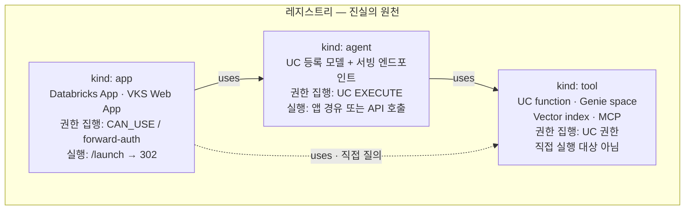
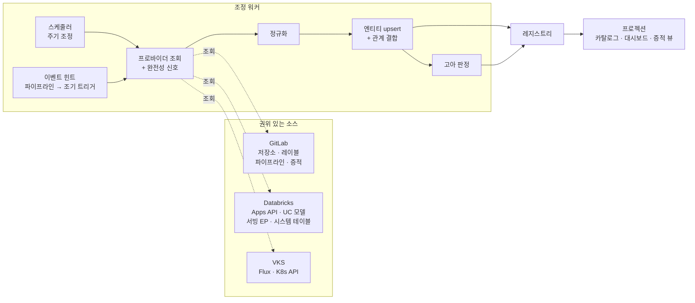

# ⑥ AX App Market 내부 아키텍처

> **목적**: 앱마켓 내부의 엔티티 모델·모듈 구조·조정 루프를 정의한다. `03` §4가 앱마켓을 4개 박스로만 표현한 부분을 여는 문서.
> **작성일**: 2026-09-12
> **근거 ADR**: `AXM-0007`(모듈러 모놀리스 + 레지스트리/프로젝션), `AXM-0008`(조정 루프), `AXM-0009`(리다이렉트), `AXM-0012`(에이전트 1급 엔티티)
> **선행 문서**: `03-runtime-decision-and-architecture.md` §4·§6, `05-physical-architecture.md` §5

---

## 1. 범위 — 무엇을 만들고 무엇을 만들지 않는가

앱마켓은 얼굴이 둘이다(`AXM-0007`). 그러나 **두 시스템이 아니라 하나의 레지스트리 위의 두 프로젝션**이다.

| | 개발자·운영 콘솔 | 임직원 스토어 |
|---|---|---|
| 사용자 | 개발자 · 플랫폼팀 · 승인자 (수십~수백) | 전 임직원 (수천~수만) |
| 하는 일 | 등록 현황 · 증적 · 승인 · 비용 · 소유권 | 검색 · 권한 신청 · 실행 |

**만들지 않는 것** — 다른 곳이 이미 하고 있다.

| 기능 | 담당 |
|---|---|
| 권한 집행 · 데이터 접근 통제 · 감사 로깅 | Unity Catalog / Unity Gateway (`AXM-0012`), Keycloak + Ingress forward-auth (`AXM-0011`) |
| 배포 오케스트레이션 | GitLab CI + Databricks Bundles + Flux |
| 스캔 · 승인 강제 | Security Policy Project (`02` §4-1) |
| 앱 실행 트래픽 중계 | **아무도 안 함 — 사용자와 런타임 직통** (`AXM-0009`) |

실무 IDP 스택은 포털 + 오케스트레이션 + 스코어카드 조합인데, 오케스트레이션 자리는 이미 차 있다. **앱마켓은 포털 + 스코어카드만 맡는다.**

---

## 2. 엔티티·관계 뷰



증적(SBOM·서명·승인이력), 판정 근거(Q1~Q8 답변), 비용·사용량은 **엔티티에 붙는 속성**이지 별도 엔티티가 아니다. 필드 구성은 `03` §6-2·§6-3을 따른다.

**읽는 법**

- **관계가 있어야 답할 수 있는 질문이 둘 있다.** "이 에이전트를 고치면 어디가 영향받는가"(`used_by`)와 "이 앱은 무엇에 의존하는가"(`uses`). 에이전트를 앱의 속성으로 두면 둘 다 못 구한다
- **`tool`은 실행 대상이 아니다.** 카탈로그에 노출하지 않고 의존성 표시와 AI-BOM 용도로만 쓴다. 임직원이 Genie space를 "실행"하지는 않는다
- **증적은 엔티티에 붙지만 불변이다.** 앱이 폐기돼도 증적은 남는다(§4-4 고아 처리)
- `app --uses--> tool` 점선은 에이전트 없이 UC를 직접 질의하는 앱이다. 흔하므로 표현은 하되, AI-BOM 대상은 아니다

---

## 3. 모듈 구조

같은 프로세스, 분리된 스키마. 경계는 컴파일러가 아니라 규율로 지킨다(`AXM-0007`).

| 모듈 | 책임 | 실행 위치 |
|---|---|---|
| `registry` | 엔티티 · 관계 · 프로바이더 · 조정 루프. **진실의 원천** | 워커 |
| `ingest` | 지표 · 비용 정규화 | 워커 |
| `catalog` | 검색 · 분류 · 상세 (프로젝션) | 웹 |
| `authz` | 공개범위 · AD 그룹 · `CAN_USE`/`EXECUTE` 오케스트레이션 | 웹 + 워커 |
| `evidence` | SBOM · 서명 · 승인이력 (불변) | 웹 |
| `launch` | 실행 엔드포인트 `/launch/:app_id` (`AXM-0009`) | 웹 |

**의존 방향은 한쪽이다.** `catalog`·`evidence`·`launch`는 `registry`를 읽기만 한다. 레지스트리는 프로젝션을 모른다. 이 방향이 지켜져야 화면이 늘어도 스키마가 흔들리지 않는다.

---

## 4. 조정 루프 뷰



### 4-1. 프로바이더

| 프로바이더 | 권위를 갖는 범위 |
|---|---|
| **GitLab** | 앱의 존재, 소유자, 컴플라이언스 레이블, 증적, 승인 이력 |
| **Databricks** | 앱·에이전트의 **실제 상태**, 서빙 버전, `CAN_USE`/`EXECUTE` 현황, 사용량, 비용 |
| **VKS** | Web App의 실제 상태, 서빙 다이제스트 |

**권위 범위를 겹치지 않게 나누는 것이 중요하다.** 두 프로바이더가 같은 필드를 쓰면 마지막에 도는 쪽이 이기고, 값이 주기마다 흔들린다.

### 4-2. 이벤트 힌트

파이프라인이 배포 후 마켓에 POST한다(`02` §9-2). **이것은 진실이 아니라 조기 트리거다.** 힌트를 받으면 해당 엔티티만 즉시 조정하고, 힌트가 유실돼도 다음 주기에 따라잡는다.

→ **마켓이 잠시 죽어도 배포가 실패하지 않는다.** 파이프라인이 마켓 API에 강결합되지 않는다.

### 4-3. ⚠️ 완전성 신호 — 이게 없으면 사고가 난다

고아 판정은 "소스에 없으니 사라졌다"는 추론이다. 그런데 **API 오류로 빈 목록이 돌아와도 똑같이 보인다.**

> 프로바이더가 일시적으로 실패해 빈 목록을 반환하면, 조정 루프가 **전체 엔티티를 고아로 판정**한다.

따라서 프로바이더는 목록과 함께 **"완전한 목록을 성공적으로 가져왔다"는 신호**를 반환해야 하고, **그 신호가 없으면 고아 판정을 건너뛴다.** 부분 조회·페이지네이션 중단·타임아웃도 모두 불완전으로 취급한다.

### 4-4. 고아 처리 — 삭제하지 않는다

| 상황 | 처리 |
|---|---|
| GitLab에서 저장소가 사라짐 | 엔티티를 `orphaned`로 표시, 소유자에게 알림 |
| Databricks/VKS에서 배포가 사라짐 | 배포 상태를 `absent`로, 엔티티는 유지 |
| N일 경과 후에도 복구 없음 | `archived` — 카탈로그에서 숨기되 레코드는 보존 |
| 증적 | **어떤 경우에도 삭제하지 않는다.** 감사 대상 |

즉시 삭제하지 않는 이유는 두 가지다. **증적은 감사 대상이라 지울 수 없고**, 일시적 실패를 삭제로 오판하면 복구가 어렵다. `03` §6의 `deprecation`과 여기서 만난다.

### 4-5. 부수 효과 — 섀도 앱·에이전트 탐지

조정 루프는 소스를 전수 조회하므로, **앱마켓을 거치지 않고 만들어진 앱과 에이전트도 발견한다.** 워크스페이스 UI에서 직접 만든 앱, 개인이 배포한 에이전트가 카탈로그에 `unregistered`로 나타난다.

이는 부작용이 아니라 **거버넌스 요구사항의 충족**이다. Gartner의 에이전트 스프롤 대응 권고가 요구하는 "중앙 인벤토리"가 이것이다.

---

## 5. 조정 워커를 분리할 것인가 — 결론

`AXM-0008`이 남긴 미결이며, **인프라 뷰의 박스 개수를 결정한다.**

### 5-1. 판단

> **같은 코드베이스·같은 컨테이너 이미지로 만들고, 실행 모드만 분리한다.** 지금은 한 서비스로 띄우고, 필요해지면 배포 설정만 바꿔 두 서비스로 늘린다.

```
같은 이미지
├── 실행 모드 web     → HTTP 서빙 (catalog · evidence · launch · authz)
└── 실행 모드 worker  → 조정 루프 · ingest (registry)
```

**지금 단계(앱 10~50개, 워크스페이스 1~3개)에서는 한 서비스로 충분하다.** 폴링 대상이 적어 조정 1회가 짧다.

### 5-2. 분리 시점 — 아래 중 하나라도 나타나면

- 조정 1회가 길어져 **요청 지연에 영향**을 준다
- 워크스페이스가 늘어 **순회 시간이 주기를 넘긴다**
- 재시도·백오프·부분 실패 처리가 복잡해져 **웹과 배포 주기를 분리**하고 싶다
- 조정 실패가 카탈로그 조회 가용성에 영향을 준다

### 5-3. 인프라 뷰에 그리는 방법

**박스 두 개로 그리되, 하나는 점선으로 표기한다.**

```
[ 앱마켓 web (2 AZ) ]     ← 지금 배포
[ 조정 워커 (점선) ]       ← 같은 이미지, 필요 시 분리
```

이러면 `05` §5-1의 사이징(작은 인스턴스 2대)은 그대로 유지되고, 분리 시 서비스 정의 하나만 추가된다.

---

## 6. 미결

| # | 항목 | 영향 |
|---|---|---|
| 1 | 프로바이더별 **폴링 주기** | Databricks API·시스템 테이블 부하와 비용 |
| 2 | 고아 → `archived` 전환까지의 **N일** | §4-4 |
| 3 | 관계의 깊이 — `agent --uses--> agent`(에이전트 간 호출) 표현 여부 | §2 |
| 4 | 임직원 UI와 개발자 콘솔을 **한 프론트엔드로 할지** | §1 |
| 5 | `unregistered` 발견 시 조치 절차 (알림 · 등록 유도 · 차단) | §4-5 |
| 6 | 이벤트 힌트의 전달 수단 (HTTP POST 유지 / 큐) | §4-2 |

> 1번은 파일럿에서 실측해야 한다. `AXM-0005`의 유휴 정지 정책이 도입되면 앱 상태가 하루에도 여러 번 바뀌므로, 주기가 너무 길면 카탈로그의 상태 표시가 계속 틀리게 된다.

---

## 관련 문서

- `docs/adr/` — `AXM-0007`, `AXM-0008`, `AXM-0009`, `AXM-0011`, `AXM-0012`
- `docs/03-runtime-decision-and-architecture.md` — §4 To-Be 전체 구성, §6 메타데이터 스키마
- `docs/05-physical-architecture.md` — §5 앱마켓 물리 구성과 사이징
- `docs/04-cost-model.md` — 지표·비용 정규화의 입력값
