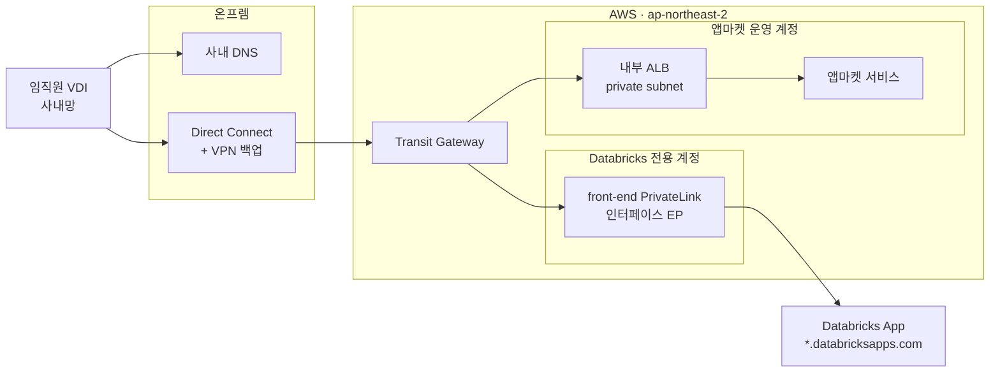
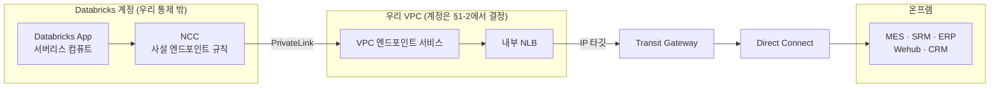

# ⑤ 물리 아키텍처 — 계정 · 네트워크 배치

> **목적**: AX App Market과 두 런타임의 **물리적 배치**(AWS 계정 구조, 네트워크 경로, DNS, 진입 경로)를 확정 가능한 형태로 정의한다.
> **작성일**: 2026-09-12
> **선행 문서**: `03-runtime-decision-and-architecture.md` (확정된 전제 F1~F7), `04-cost-model.md`, `axplayground_PoC 아키텍처.drawio.xml`
> **범위**: 논리 구성(`03` §4)을 물리 자원에 매핑하는 것까지. 앱마켓 애플리케이션 내부 설계는 별도 문서.

---

## 0. 확정된 전제

`03` 문서 §전제의 F1~F7을 그대로 따른다. 물리 설계에 직접 작용하는 것만 다시 적는다.

| # | 사실 |
|---|---|
| F1 | AWS · **ap-northeast-2 (서울)** |
| F2 | **Databricks는 별도 전용 AWS 계정** |
| F3 | Databricks 계약 **Enterprise tier** |
| F4 | 온프렘 ↔ AWS **VPN + Direct Connect + TGW 기구축, 라우팅 구성 완료** |
| F5 | 사용자 진입은 **Direct Connect 경유. 인터넷 노출 없음** |
| F6 | 앱마켓은 **AWS 전용 계정에 별도 구현** |
| F7 | Playground = **Coder 기반 클라우드 개발환경** (PoC 가동 중, 계정 259537089696) |

**미확정**: A5(망분리 대상 여부·취급 데이터 등급) → §8-1

---

## 1. 계정 토폴로지

### 1-1. 계정 구성

> 📐 **도면**: `ax-market_target 아키텍처.drawio.xml` — 1페이지 인프라 뷰(배치·물리 연결), 2페이지 경로 뷰(사용자 진입 / 앱→사내 시스템 / 조정 루프).

F2·F6·F7에 따라 최소 3개 계정이 존재한다. **Playground ADR-0002**의 dual-account 원칙과 정합한다. → `AXM-0002`

| 계정 | 역할 | 상태 | 주요 자원 |
|---|---|---|---|
| **Databricks 전용** | Databricks 워크스페이스(데이터 플레인) | 기존 | 워크스페이스, UC 메타스토어, SQL Warehouse |
| **앱마켓 운영** | AX App Market 서비스 | **신규** | 내부 ALB, 앱 컴퓨트, 관리형 DB, 증적 스토리지 |
| **Playground** (259537089696) | Coder 개발환경 | PoC 가동 중 | Coder Server, 워크스페이스 EC2 |
| **공유 네트워크** (있는 경우) | TGW·DX·DNS 중앙 관리 | **확인 필요** | TGW, Route53 Resolver, 중앙 NLB 후보 |

> ⚠️ **Databricks 서버리스 컴퓨트는 위 어느 계정에도 없다.** Databricks 자신의 계정에서 실행된다. F2의 "전용 계정"은 워크스페이스가 귀속된 우리 계정을 뜻하며, Apps·서버리스 웨어하우스의 실행 위치와는 다르다. §3의 경로 설계가 이 구분 위에 성립한다.

### 1-2. 결정 필요 — 내부 NLB를 어느 계정에 둘 것인가

§3 경로의 중계점인 NLB는 **모든 Databricks App의 사내 시스템 접근이 통과하는 단일 지점**이다. 배치 계정에 따라 운영 주체와 통제 지점이 달라진다.

| 안 | 배치 | 장점 | 단점 |
|---|---|---|---|
| **A. 공유 네트워크 계정** ⭐ | TGW·DX를 소유한 계정 | 온프렘 경로와 통제가 한 곳. 랜딩존 관례에 부합. 계정 간 중복 없음 | 공유 계정이 없으면 신설 필요 |
| B. 앱마켓 운영 계정 | 앱마켓과 동거 | 신규 계정 하나로 끝 | 앱마켓 장애·변경이 데이터 경로에 영향. 역할 혼재 |
| C. Databricks 전용 계정 | 워크스페이스와 동거 | NCC 구성이 계정 내에서 완결 | 사내망 경로 통제가 데이터 계정에 분산 |

PrivateLink는 계정 간 연결을 전제로 설계된 기능이므로 **어느 안이든 기술적으로 성립한다.** 선택 기준은 **누가 사내 시스템 노출을 운영·감사하는가**이다. → §8-2

---

## 2. 사용자 진입 경로 (F5)

### 2-1. 목표 구성



**핵심: 두 런타임의 진입이 모두 사내망 안에서 끝난다.** 인터넷 노출이 0이므로 보안 심사를 한 번으로 처리할 수 있고, 사용자가 앱마켓에서 앱으로 이동할 때 경로 성격이 바뀌지 않는다.

### 2-2. 구성 요소

| 대상 | 진입 | 필요 구성 |
|---|---|---|
| **앱마켓** | 내부 ALB (private subnet) | ACM 인증서 + 사내 도메인. IGW 불필요 |
| **Databricks 워크스페이스 · Apps** | front-end PrivateLink 인터페이스 EP | **`databricksapps.com` 조건부 DNS 포워딩 필수**(§4). 계정 콘솔의 private access settings 등록 |

### 2-3. PoC와의 차이 — 전환 시 반드시 교체

PoC는 **퍼블릭 인터넷 진입 + SG IP allowlist**(사용자 → IGW → EIP)다. F5와 다르다.

| PoC | 운영 |
|---|---|
| IGW + EIP 퍼블릭 진입 | DX/TGW 사설 진입, IGW 없음 |
| SG 443 = 회사/VDI IP allowlist | 사내망 도달 자체가 경계 |
| 자체서명 TLS | ACM 인증서 + 사내 DNS 도메인 |
| **"임시 외부 오픈"** | **PoC 종료 시 즉시 회수** |

---

## 3. Databricks Apps → 온프렘 경로 (Q1의 근거)

`03` §3 Q1 재정의의 물리적 실체다.

### 3-1. 경로



**근거** — Apps 네트워킹 공식 문서:

> "To restrict egress to private destinations such as an S3 bucket or **a network load balancer (NLB)**, configure PrivateLink connections as part of your NCC setup."

### 3-2. 요구사항과 한도

| 항목 | 내용 |
|---|---|
| tier | **Enterprise 전용** — ✅ F3으로 충족 |
| 구성요소 | 내부 스킴 NLB + VPC 엔드포인트 서비스 + 워크스페이스와 동일 리전의 NCC 객체 |
| 한도 | 리전·계정당 NCC 10 / 리전당 사설 엔드포인트 30 / NCC당 워크스페이스 50 / 엔드포인트 규칙당 도메인 100 |
| 제약 | **DNS chasing·DNS redirect 미지원.** 모든 도메인이 백엔드로 직접 해석되어야 한다 → §4 |

### 3-3. 검증이 남은 한 구간

**NLB 타깃을 온프렘 IP로 두는 구성.** AWS NLB의 IP 타입 타깃은 DX/VPN 너머 주소를 지원하므로 성립할 것으로 보나, **이 구간은 Databricks 문서 범위 밖**이며 네트워크 담당 확인이 필요하다. F4로 라우팅이 이미 구성되어 있으므로 확인 자체는 가볍다.

**최소 검증 방법**: 대상 사내 시스템 1개를 타깃으로 하는 내부 NLB를 만들고, 같은 VPC의 EC2에서 NLB를 통해 도달되는지부터 확인한다. 여기까지 되면 나머지는 PrivateLink 구성 문제다.

### 3-4. 보안 승인 패키지에 담을 것

Q1의 실질 판정 기준이 "보안 승인 가능 여부"가 되었으므로, 승인 요청 시 다음을 함께 제시하면 논의가 짧아진다.

- 노출되는 것은 **NLB 뒤의 특정 포트뿐**이며 사내망 전체가 아니다
- 접근 주체는 **NCC에 등록된 우리 워크스페이스로 한정**된다 (VPC 엔드포인트 서비스의 허용 주체 제어)
- 트래픽은 인터넷을 경유하지 않는다 (PrivateLink + DX)
- 네트워크 정책(Enterprise)으로 앱의 이그레스를 허용목록으로 제한할 수 있다
- 감사: VPC 플로우 로그 + NLB 액세스 로그 + `system.access.audit`

---

## 4. DNS 설계

경로가 전부 사설이므로 **DNS가 성립 조건**이 된다. 세 종류의 해석이 필요하고, 셋 다 온프렘과 AWS 양쪽에서 맞아야 한다.

| # | 해석 대상 | 방향 | 방법 |
|---|---|---|---|
| 1 | `*.databricksapps.com` (앱 URL) | 사내 → AWS | **조건부 포워딩** → front-end PrivateLink EP의 프라이빗 IP |
| 2 | Databricks 워크스페이스 도메인 | 사내 → AWS | 동일. 워크스페이스 URL과 REST API가 같은 EP를 쓴다 |
| 3 | 앱마켓 사내 도메인 | 사내 → AWS | 내부 ALB를 가리키는 A 레코드 |
| 4 | 사내 시스템 FQDN | **Databricks → 온프렘** | §3-2의 **DNS chasing 미지원** 제약. 엔드포인트 규칙의 도메인이 NLB로 직접 해석되어야 한다 |

**필요 구성**
- **Route53 Resolver inbound endpoint** — 온프렘 DNS가 AWS 프라이빗 영역을 질의
- **Route53 Resolver outbound endpoint + 포워딩 규칙** — AWS에서 사내 도메인을 질의
- 온프렘 DNS에 조건부 포워딩 존 등록 (보안·인프라팀 협의 대상)

> ⚠️ 4번이 까다롭다. 사내 시스템이 CNAME 체인이나 GSLB로 해석된다면 **DNS chasing 미지원 제약에 걸린다.** 대상 시스템의 FQDN이 어떻게 해석되는지 사전 확인하고, 필요하면 NLB 전용 FQDN을 새로 부여하는 편이 안전하다.

---

## 5. 앱마켓 자체 물리 구성

### 5-1. 가용성 등급

**앱마켓은 모든 앱의 진입점이다. 개별 앱보다 높은 가용성 등급을 가져야 한다.** PoC의 단일 EC2 + built-in PostgreSQL 패턴을 그대로 가져오면 안 된다.

| 항목 | 최소 요건 |
|---|---|
| 컴퓨트 | Multi-AZ. 최소 2 AZ에 분산 |
| DB | 관리형(RDS/Aurora) Multi-AZ. 자동 백업 + 시점 복구 |
| 진입 | 내부 ALB (2 AZ의 private subnet) |
| 증적 저장 | S3 + 버전 관리 + 수명주기. 증적은 감사 대상이므로 삭제 방지 |

> **사이징 근거**: `AXM-0009`(리다이렉트)에 따라 앱마켓은 **저트래픽 서비스**다. 처리하는 것은 카탈로그 조회·검색·실행 클릭이며 앱 사용 트래픽은 통과하지 않는다. 임직원 1만 명이 하루 5회 열어도 5만 요청/일 · 피크 수십 건/초 수준이므로 **작은 인스턴스 2대(2 AZ)면 충분**하다.
>
> 프록시 방식을 택했다면 전 앱 트래픽의 합을 받아야 하고, 온프렘 VKS 앱 트래픽이 DX를 왕복하게 된다. 사이징이 자릿수 단위로 달라진다.

### 5-2. 컴퓨트 선택 (결정 필요)

| 안 | 평가 |
|---|---|
| **ECS Fargate** ⭐ | 웹 서비스 하나에는 운영 부담이 가장 낮다. 노드 관리 없음 |
| EKS | 온프렘 VKS와 매니페스트·운영 방식을 통일하고 싶으면. 다만 앱마켓 하나를 위해 클러스터를 운영하는 비용 |
| EC2 | PoC 연장선. 운영에는 비권장 |

### 5-3. 앱마켓의 대외 연결

| 대상 | 경로 |
|---|---|
| **Databricks REST API** (앱 등록·`CAN_USE` 부여·상태 조회) | cross-account. §2-2의 front-end PrivateLink EP를 앱마켓 VPC에도 두는 것이 F5와 일관 |
| **VKS API / Ingress** (상태 조회, 실행 엔드포인트의 런타임 주소 확인) | TGW → DX. `AXM-0008` 조정 루프가 사용 |
| **온프렘 AD / Keycloak** | TGW → DX. 앱마켓 컴퓨트는 private subnet에 두고 사내망 경로를 갖는다 |
| **온프렘 GitLab** (증적·파이프라인 조회) | 동일 |
| 시스템 테이블 질의 (지표·비용) | Databricks SQL. 공용 웨어하우스 경유 (`04` §6-2) |

> PoC의 가드레일("퍼블릭 RT에 TGW 경로 미부여")은 옳지만, **앱마켓은 사내망을 봐야 한다.** 진입 경로와 사내망 경로를 같은 서브넷에 섞지 말고, **진입 = 내부 ALB / 애플리케이션 = private subnet + TGW 경로**로 계층을 분리한다.

### 5-4. 부트스트랩 문제

앱마켓도 AX App이라면 자기 자신의 검증 게이트를 통과해야 한다. 그러나 게이트의 등록 대상이 앱마켓이므로 순환한다.

→ **앱마켓은 "플랫폼 서비스"로 분류하고 앱 카탈로그의 대상에서 제외**하되, 파이프라인 검증(SAST/SCA/SBOM/승인)은 동일하게 적용하는 것이 단순하다. `02` §2 저장소 구조의 `marketplace/app-market`이 이미 `apps/` 밖에 있으므로 구조상으로도 일관된다.

---

## 6. 아웃바운드 · 패키지 저장소

F3(Enterprise)으로 **네트워크 정책**을 쓸 수 있게 되었으므로 앱 이그레스를 허용목록으로 제한할 수 있다. 다만 반드시 함께 처리할 것이 있다.

- **`pypi.org` / `registry.npmjs.org`를 허용목록에 넣거나 사내 미러를 쓴다.** 누락이 앱 배포 실패의 흔한 원인이다
- 이것은 **`04` 문서에서 지적한 "Databricks가 배포 시점에 의존성을 해석한다"는 문제와 같은 지점**이다. 사내 미러 + `uv` 락파일 + 해시 고정을 함께 적용하면 이그레스 통제와 SBOM 정합성을 동시에 얻는다
- **Bedrock 인터페이스 VPC 엔드포인트** — PoC는 NAT 경유(인터넷)다. 운영 전환 시 엔드포인트로 교체. A5(데이터 등급)에 따라 필수 여부가 결정된다

---

## 7. PoC → 운영 전환 체크리스트

PoC 도면의 원칙("단일 replica · 도메인 X · built-in DB · 자체서명 TLS · 1인 운영")은 PoC로서 옳다. 아래는 **운영 전환 시 교체 목록**이다.

```
[네트워크]
[ ] 전용 신규 VPC (Playground ADR-0002). /22에 타인 자원 공존하는 현 VPC 사용 금지
[ ] CIDR 확보 — 사내 IP 대역 관리 부서 협의 (리드타임 있음)
[ ] Public /27(32 IP) → 운영 규모에 맞는 서브넷 설계
[ ] IGW 퍼블릭 진입 제거 → DX/TGW 사설 진입 (F5)
[ ] PoC의 "임시 외부 오픈" 회수

[보안]
[ ] 자체서명 TLS → ACM 인증서 + 사내 도메인
[ ] Bedrock NAT 경유 → 인터페이스 VPC 엔드포인트
[ ] VPC 플로우 로그 · ALB/NLB 액세스 로그 활성화

[가용성]
[ ] 단일 EC2 → Multi-AZ
[ ] built-in PostgreSQL → 관리형 DB + 백업·복구 절차
[ ] 1인 운영 → 운영 주체·당직 체계 정의

[Playground]
[ ] Coder 워크스페이스 → 온프렘 GitLab push 경로 확인 (F4로 라우팅은 구성됨)
[ ] Golden Path 스캐폴드를 Coder 워크스페이스 템플릿 + Dev Container 이미지에 결선
[ ] 워크스페이스 수명주기 · 유휴 정지 (EC2 상시 과금)
```

---

## 8. 미결 사항

### 8-1. A5 — 망분리 대상 여부와 취급 데이터 등급 ⭐

물리 설계에서 가장 크게 남은 축이다. **결정하기 전에는 §6의 Bedrock 엔드포인트 필수 여부와 §3의 보안 승인 가능성을 판단할 수 없다.**

정해나가야 한다고 하셨으므로, 최소 형태의 초안을 제안한다. 등급을 3단계로 두고 **판정 트리(`03` §2)의 입력으로 쓰는 것**이 목적이다.

| 등급 | 정의 | 런타임 제약(안) | 추가 통제(안) |
|---|---|---|---|
| **C1 일반** | 공개·사내 일반 정보 | 제약 없음 | 기본 게이트 |
| **C2 내부** | 영업·생산 데이터, 가명정보 | 제약 없음 | UC 마스킹 필수, 이그레스 허용목록 |
| **C3 민감** | 개인정보, 영업비밀 | **1층 차단 조건 후보** — 별도 승인 없이는 Private Cloud | UC 행·열 보안 필수, 반출 경로 검토, 감사 강화 |

- C3를 1층에 둘지 2층에 둘지가 실질 논점이다. **Q5(UC 행·열 보안 상속)를 근거로 보면 C3야말로 Databricks가 유리**하므로, 무조건 차단이 아니라 **"승인 시 Databricks 허용"** 이 합리적이다
- 이 등급은 `03` §6 메타데이터에 필드로 추가되어야 한다 (현재 없음)

### 8-2. 그 밖

| # | 항목 | 막히는 것 | 확인처 |
|---|---|---|---|
| 1 | **내부 NLB를 어느 계정에 둘 것인가** | §3 경로의 운영·감사 주체 | 플랫폼·네트워크팀 (§1-2) |
| 2 | 공유 네트워크 계정 존재 여부, TGW 소유·RAM 공유 방식 | §1-1 계정 표 | 클라우드 인프라 담당 |
| 3 | **NLB IP 타깃 → 온프렘 도달 검증** | Q1 성립 | 네트워크 담당 (§3-3) |
| 4 | 사내 시스템 FQDN의 해석 방식 (CNAME/GSLB 여부) | DNS chasing 제약 (§4) | 시스템 담당 |
| 5 | 앱마켓 운영 계정 CIDR 확보 | §7 | IP 대역 관리 부서 — **리드타임 최장** |
| 6 | 앱마켓 컴퓨트 선택 (ECS/EKS/EC2) | §5-2 | 플랫폼팀 |
| 7 | **Agent App 런타임의 LLM** — Databricks 모델서빙인가 Bedrock인가 | `02` §8 Agent 게이트, `04` §2-3 변동비 | 아키텍처 결정 |
| 8 | **Playground ADR 시리즈와의 정합** (ADR-0002 외에 무엇이 있는가) | 전반 | PoC 주관자 확인. 본 프로젝트 결정은 `docs/adr/`의 `AXM-` 시리즈 |

> 3번과 5번을 먼저 착수할 것. 3번은 Q1 판정의 마지막 조각이고, 5번은 리드타임이 가장 길다.

---

## 참고

- [Configure networking for Databricks Apps (공식)](https://docs.databricks.com/aws/en/dev-tools/databricks-apps/networking) — Apps egress에서 NLB로의 PrivateLink
- [Configure private connectivity to resources in your VPC (공식)](https://docs.databricks.com/aws/en/security/network/serverless-network-security/pl-to-internal-network) — Enterprise tier 요구, 한도, DNS chasing 제약
- [Manage private endpoint rules (공식)](https://docs.databricks.com/aws/en/security/network/serverless-network-security/manage-private-endpoint-rules)
- [Configure Inbound PrivateLink (공식)](https://docs.databricks.com/aws/en/security/network/front-end/front-end-private-connect)
- [Private and Dedicated Connectivity Patterns for Databricks Serverless Using Private Link (Databricks 기술 블로그)](https://community.databricks.com/t5/technical-blog/private-and-dedicated-connectivity-patterns-for-databricks/ba-p/91134)

---

## 관련 문서

- `docs/diagrams/ax-market_target 아키텍처.drawio.xml` — **목표 인프라 도면** (인프라 뷰 / 경로 뷰). 본 문서 §1~§5를 그림으로 옮긴 것
- `docs/diagrams/axplayground_PoC 아키텍처.drawio.xml` — Playground PoC 아키텍처 (논리 뷰 / 인프라 뷰). 전환 범위 대조용
- `docs/adr/` — 아키텍처 결정 기록 (`AXM-` 시리즈). 각 결정의 근거와 기각된 대안
- `docs/design/03-runtime-decision-and-architecture.md` — 확정된 전제 F1~F7, 판정 트리, To-Be 논리 구성
- `docs/design/04-cost-model.md` — 운영 비용 모델
- `docs/design/06-app-market-architecture.md` — 앱마켓 내부. 엔티티·관계, 모듈 구조, 조정 루프, 워커 분리 판단
- `docs/design/02-cicd-pipeline-design.md` — CI/CD 파이프라인 설계
- `docs/reference/databricks-apps-reference.md` — Databricks Apps 기술 레퍼런스 (§7 네트워크)
