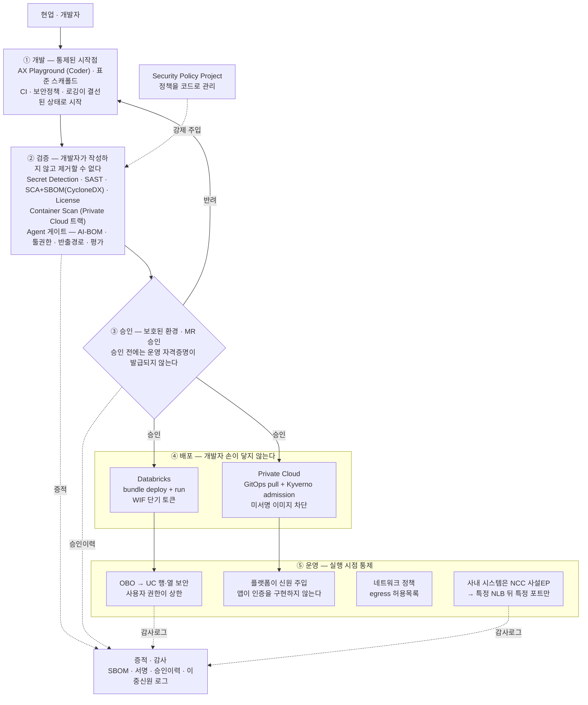

# ⑦ DevSecOps — 안전한 배포 경로

> **이 문서가 답하는 질문**: 현업·개발자가 AX Playground에서 만든 앱을, **어떻게 안전하게 운영에 올릴 것인가.**
> **대상**: 보안전략팀 사전 논의
> **작성일**: 2026-09-12
> **선행 문서**: `02`(파이프라인 설계), `03`(런타임 판정), `05`(물리), `06`(앱마켓 내부)

**전제 하나를 먼저 밝힌다.** 앱을 만드는 사람은 보안 전문가가 아니다. 현업 담당자가 Playground에서 코딩 어시스턴트를 써서 만든다. 따라서 설계의 목표는 **"개발자가 보안을 잘 지키게 하는 것"이 아니라 "잘못할 수 없게 만드는 것"** 이다.

---

## 1. 통제 지도 — 개발자 여정 위의 게이트

---

## 2. 개발자가 **구조적으로 할 수 없는 것** 여덟 가지

이 표가 이 문서의 핵심이다. "하지 말라고 교육한다"가 아니라 **경로 자체가 없다.**

| # | 할 수 없는 것 | 무엇이 막는가 | 어디서 |
|---|---|---|---|
| 1 | **운영에 직접 배포** | 배포 경로가 파이프라인 하나뿐. 개발자에게 운영 워크스페이스·클러스터 자격증명이 없다 | `02` §3 |
| 2 | **보안 검사 건너뛰기** | Scan Execution Policy로 주입한다. 개발자 저장소의 `.gitlab-ci.yml`에 **잡이 존재하지 않으므로 삭제할 수도 없고**, `[skip ci]`로도 건너뛸 수 없다 | `02` §4-1 |
| 3 | **승인 전에 운영 자격증명 획득** | 운영 배포 잡은 **보호된 환경에서만 실행**되고, ID 토큰 발급 자체가 그 뒤에 있다. 승인받지 못하면 **토큰을 얻지 못한다** | `02` §3 |
| 4 | **자기 권한 이상의 데이터 조회** | OBO + Unity Catalog 행 필터·컬럼 마스킹. **앱 코드가 무엇을 하든 접속한 사용자의 권한이 상한이다** | `03` §5-2 |
| 5 | **미서명·변조 이미지 실행** | Kyverno admission이 Cosign 서명과 SLSA provenance를 검증한다 (Private Cloud) | `02` §5-3 |
| 6 | **임의의 외부로 데이터 반출** | 네트워크 정책으로 egress를 허용목록화한다 (Enterprise tier) | `05` §6 |
| 7 | **인증 없이 앱 노출** | 플랫폼이 신원을 주입한다 — Databricks OAuth / Ingress forward-auth. **앱이 인증을 구현하지 않으므로 잘못 구현할 수도 없다** | `AXM-0011` |
| 8 | **사내 시스템에 임의 접근** | NCC 사설 엔드포인트 → 지정된 내부 NLB 뒤의 **특정 포트만**. 사내망 전체가 열리지 않는다 | `AXM-0004` |

**4번과 7번이 이 설계의 무게중심이다.** 현업이 만든 앱에서 가장 위험한 것은 데이터 과다 노출과 인증 오구현인데, 둘 다 **앱 코드의 품질과 무관하게** 플랫폼이 막는다.

> 4번을 뒤집어 말하면: **앱에 취약점이 있어도 그 사용자가 원래 볼 수 있는 데이터까지만 노출된다.** 권한 상승이 구조적으로 불가능하다.

---

## 3. 두 트랙의 통제 대응

증적은 형태가 달라도 **등급은 같아야 한다**는 것이 설계 원칙이다(`02` §1).

| 통제 항목 | Private Cloud (VKS) | Databricks Apps |
|---|---|---|
| 무엇이 들어있나 | CycloneDX SBOM (소스 + 컨테이너) | CycloneDX SBOM (소스) |
| 어떻게 만들어졌나 | **SLSA provenance** | 커밋 해시 + 파이프라인 ID + 번들 배포 기록 |
| 신뢰된 빌더인가 | **Cosign 서명** | 파이프라인 서명 |
| 실행 허용 판정 | **Kyverno admission** | 워크스페이스 관리자 리소스 승인 |
| 누가 승인했나 | 보호된 환경 승인 이력 | 보호된 환경 승인 이력 |
| 실제 서빙 버전 | 매니페스트 다이제스트 | `assert-version` 결과 |
| 사용자 인증 | Ingress forward-auth (Cognito, `AXM-0014`) | Databricks OAuth (Cognito OIDC) |
| 데이터 접근 통제 | **앱 코드 책임 ← 격차** | **OBO → UC 자동 적용** |
| 이그레스 통제 | 클러스터 네트워크 정책 | Databricks 네트워크 정책 |
| 감사 | GitLab 감사 로그 + 클러스터 로그 | `system.access.audit` + 추론 테이블(에이전트) |

마지막에서 두 번째 행이 유일하게 등급이 다르다. §5-1에서 다시 다룬다.

---

## 4. 신뢰 경계와 자격증명

**도면**: `diagrams/ax-market_target 아키텍처.drawio.xml` 3페이지 "보안 뷰"

### 4-1. 신뢰 경계

| 경계 | 내용 |
|---|---|
| 온프렘 | GitLab · VKS · 사내 업무 시스템 · VDI. **우리 통제** |
| AWS 우리 계정 | 앱마켓 · Databricks 워크스페이스 · Playground. **우리 통제** |
| **Databricks 소유 계정** | **Apps·에이전트의 서버리스 컴퓨트가 여기서 돈다. 우리 통제 밖** |
| 인터넷 | **사용자 진입 경로에 인터넷 구간이 없다** (`AXM-0003`) |

### 4-2. 자격증명이 어디에 있고 없는가

시크릿리스를 기본으로 한다. **장기 자격증명을 CI에 저장하는 것은 안티패턴**이라는 것이 현재 업계 기준이다.

| 연결 | 자격증명 | 비고 |
|---|---|---|
| CI → Databricks | **WIF 단기 토큰** (잡 타임아웃 또는 5분 만료) | 저장된 시크릿 없음. ⚠️ 성립 여부 미확정 → §5-4 |
| CI → VKS | **없음.** agentk가 클러스터에서 KAS로 양방향 채널을 연다 | 인바운드 방화벽 개방 불필요 |
| CI → Harbor | 배포 전용 로봇 계정 (보호된 변수) | |
| **CI → GitOps 저장소** | **프로젝트 액세스 토큰** | ⚠️ **공급망상 최고 권한.** 경로 범위 제한 필요 |
| Cosign 서명 | KMS 참조 | ⚠️ 방식 미정 → §6-3 |
| 앱 → UC 데이터 | **사용자 OBO 토큰** (`x-forwarded-access-token`) | 앱이 보관하지 않는다 |
| 앱 → 기타 자원 | 앱 전용 SP (`DATABRICKS_CLIENT_SECRET`) | SP 모드는 **예외 승인 대상** |
| 에이전트 → 툴 | UC 권한 + OBO | 공유 서비스 계정 아님 |

---

## 5. 남아 있는 공백 — 먼저 밝힌다

보안 검토에서 나올 항목이므로 우리가 먼저 꺼낸다.

### 5-1. Private Cloud 트랙의 행·열 데이터 통제

`AXM-0011`(Ingress forward-auth)로 **"누구인가"는 플랫폼이 보장**하게 되지만, **"그 사람이 어느 행을 볼 수 있는가"는 여전히 앱 코드 책임**이다. Databricks 트랙의 OBO에 해당하는 것이 Private Cloud에는 없다.

→ 이것이 `03` Q5가 Databricks를 선호하는 이유이자, **민감 데이터 앱을 Databricks로 유도하는 근거**다. 공통 데이터 접근 계층을 둘지는 별도 결정 사항.

### 5-2. CI가 만든 SBOM과 실제 설치본의 불일치

**Databricks Apps는 배포 시점에 워크스페이스 안에서 의존성을 해석·설치한다.** CI에서 만든 SBOM은 CI의 해석 결과이므로 실제 설치본과 다를 수 있다. §3의 "증적 등급 동등성"의 실질적 구멍이다.

→ 완화: `uv` 락파일 + **해시 고정**(`--require-hashes`) + **사내 PyPI 미러**. 셋을 함께 적용해야 CI SBOM = 런타임 구성이 된다. 컨테이너 스캔이 없는 트랙에서 유일한 대체 통제다.

### 5-3. Agent App의 프롬프트 인젝션

일반 코드 스캔(SAST/SCA/Secret)은 **프롬프트 인젝션, 과도한 툴 권한, 데이터 반출 경로를 잡아내지 못한다.** AI 모델은 기존 스캐너가 읽을 수 없는 서드파티 의존성이다.

→ 대응: AI-BOM 등록, 툴 권한 범위 심사(셸 실행·쓰기 권한은 승인 필수), 시스템 프롬프트 하드닝 체크리스트, Databricks Agent Evaluation, 자원 한도. **다만 이는 게이트이지 탐지가 아니다.** 런타임 방어는 별도 논의가 필요하다.

### 5-4. ⚠️ "우회할 수 없다"의 근거가 GitLab Ultimate에 걸려 있다

**§2의 2번(보안 검사 건너뛰기 불가)이 이 문서에서 가장 강한 통제인데, 그 근거인 Security Policy Project·컴플라이언스 프레임워크가 GitLab Ultimate 전용이다. tier가 아직 확인되지 않았다.**

Ultimate가 아니면 필수 템플릿 `include` + 보호 브랜치 + MR 승인 규칙 조합으로 대체해야 하는데, **개발자가 `include`를 지울 수 있으므로 강제 등급이 내려간다.** 이 경우 통제 모델 전체를 다시 봐야 한다.

### 5-5. WIF 성립 여부

온프렘 GitLab을 issuer로 하는 Databricks WIF가 성립하지 않으면 시크릿 관리 체계가 필요해진다(§4-2). 검증 절차는 `01` 문서에 있고, 대안은 우선순위대로 세 가지다 — JWKS 제한 공개 / 클라우드 Runner + 클라우드 아이덴티티 / OAuth 시크릿 + Vault.

### 5-6. 데이터 등급 체계 부재

등급이 없으면 **등급별 차등 통제를 설계할 수 없다.** 지금은 모든 앱에 같은 게이트를 적용한다.

---

## 6. 보안전략팀에 요청하는 결정

| # | 요청 | 무엇이 막혀 있는가 | 참조 |
|---|---|---|---|
| **1** | **사내 시스템을 내부 NLB 뒤에 노출하는 것의 승인** | 사내 시스템 연동 앱을 Databricks에 둘 수 있는지가 여기서 갈린다. 노출되는 것은 NLB 뒤 특정 포트뿐이고, 접근 주체는 우리 워크스페이스로 한정되며, 인터넷을 경유하지 않는다 | `AXM-0004`, §2-8 |
| **2** | **망분리 대상 여부와 데이터 등급 체계 확정** | 등급별 차등 통제, Bedrock 엔드포인트 구성, 판정 트리의 등급 축. C1/C2/C3 초안은 `05` §8-1 | §5-6 |
| **3** | **Cosign 서명 키 관리 방식** — KMS / keyless(Fulcio·Rekor) / 자체 Sigstore | 폐쇄망에서 keyless가 불가하면 KMS로 가야 한다. 미정이면 Private Cloud 트랙의 공급망 게이트를 착수할 수 없다 | `02` §5-3 |
| **4** | **즉시 차단 절차** (퇴사·사고 시) | 앱마켓의 권한 회수는 그룹 동기화 주기만큼 지연된다. 최종 수단은 AD/SSO 계정 잠금으로 보는데, 이 절차의 확인이 필요하다 | `AXM-0009` |
| **5** | **WIF 불가 시 대안 승인 가능성** — GitLab의 OIDC discovery·JWKS 두 경로만 DMZ로 제한 공개 | 공개되는 것은 OIDC 메타데이터와 **공개키**뿐이다. 개인키·소스·사용자 정보는 포함되지 않는다. 검토 포인트는 GitLab 호스트명이 외부에 드러난다는 점 | `01` §5 B-1 |

**추가로 합의가 필요한 것 하나** — Kyverno 서명 검증의 **Audit → Enforce 전환 시점.** 처음부터 Enforce로 걸면 기존 워크로드가 멈추므로, 관찰 기간을 두고 팀들이 서명을 붙이게 한 뒤 전환하는 것이 업계 표준 절차다. 관찰 기간의 길이를 함께 정하고 싶다.

---

## 관련 문서

- `docs/design/02-cicd-pipeline-design.md` — 파이프라인·정책 주입 상세
- `docs/design/01-gitlab-databricks-wif-verification.md` — WIF 검증 절차와 대안
- `docs/design/05-physical-architecture.md` — 네트워크 경로, 보안 승인 패키지 초안(§3-4)
- `docs/reference/cicd-devsecops-research.md` — 업계 동향과 근거
- `docs/adr/` — `AXM-0003`, `AXM-0004`, `AXM-0009`, `AXM-0011`, `AXM-0012`
